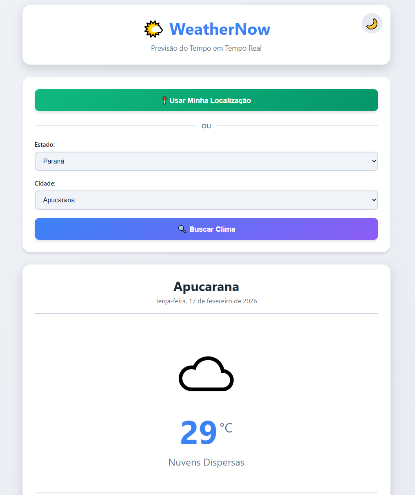
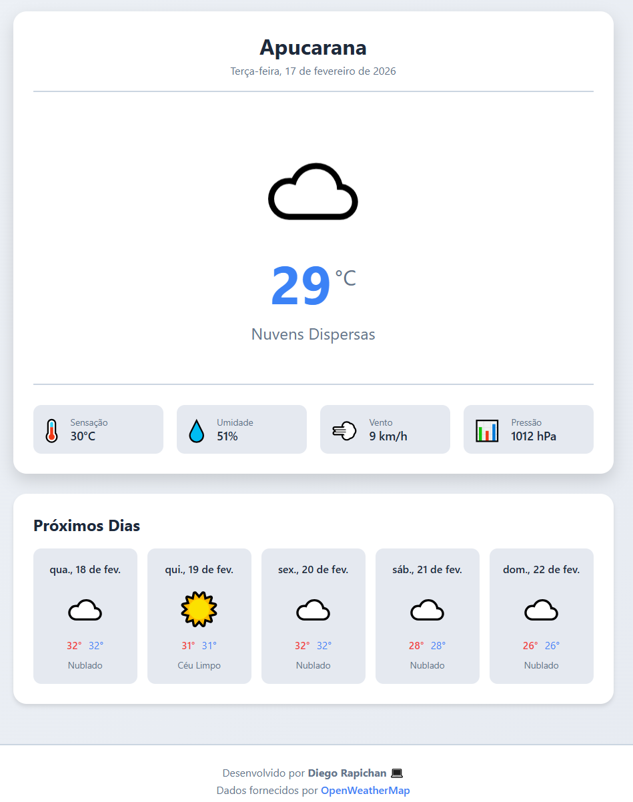

# 🌤️ WeatherNow - Previsão do Tempo

> Aplicação web de previsão do tempo com geolocalização e busca manual por cidade

---

[](https://weather-control.onrender.com/)

## 🎯 Sobre o Projeto

**WeatherNow** é uma aplicação de previsão do tempo que permite:

- 📍 Usar sua localização GPS automaticamente
- 🔍 Buscar manualmente por estado e cidade
- 🌡️ Ver temperatura atual e condições climáticas
- 📅 Visualizar previsão para os próximos 5 dias

**Perfeito para aprender:** DOM, APIs, Geolocalização, Fetch, Promises!

---

## ✨ Funcionalidades

### 📍 Localização Automática

- Botão "Usar Minha Localização"
- Pega GPS automaticamente
- Mostra clima da sua cidade atual

### 🔍 Busca Manual

- Select de Estados (27 estados brasileiros)
- Select de Cidades (carrega automaticamente as cidades do estado)
- Busca inteligente

### 🌡️ Informações do Clima

- Temperatura atual
- Sensação térmica
- Umidade
- Velocidade do vento
- Pressão atmosférica
- Descrição das condições

### 📅 Previsão 5 Dias

- Temperatura máxima e mínima
- Condições climáticas
- Ícones animados

### 🎨 Interface

- Design moderno
- Dark Mode 🌙
- Ícones animados
- Responsivo (mobile/desktop)

---

## 📸 Screenshots

### Pesquisa Cidade


_Interface moderna e possibilidade de uso de geolocalização_

### Previsão Cidade


_Retorna no momento, e dos próximos 5 dias_

---

## 🚀 Como Usar

### 1️⃣ Baixar os Arquivos

Você precisa de 4 arquivos na mesma pasta:

```
weathernow/
├── weather-index.html
├── weather-style.css
├── weather-app.js
└── cities-data.js
```

### 2️⃣ Abrir no Navegador

**Opção A:** Duplo clique em `weather-index.html`

**Opção B (Melhor):** VS Code + Live Server

```
1. Abre VS Code na pasta
2. Instala extensão "Live Server"
3. Botão direito → "Open with Live Server"
```

### 3️⃣ Usar o App

**Modo Rápido:**

```
1. Clica "📍 Usar Minha Localização"
2. Aceita permissão
3. PRONTO! Clima aparece!
```

**Modo Manual:**

```
1. Seleciona o Estado
2. Seleciona a Cidade
3. Clica "🔍 Buscar Clima"
```

---

## 🔑 API Utilizada

**OpenWeatherMap API** (Gratuita!)

- Site: https://openweathermap.org/
- Limite: 1000 chamadas/dia (grátis)
- Dados em português

### Como Obter Sua Chave:

1. Acessa: https://openweathermap.org/
2. Cria conta grátis
3. Vai em "API Keys"
4. Copia sua chave
5. Substitui no `weather-app.js` linha 14:
   ```javascript
   const API_KEY = "SUA_CHAVE_AQUI";
   ```

**IMPORTANTE:** A chave no código é de exemplo. Para produção, gere a sua!

---

## 🎓 Conceitos Aprendidos

Este projeto ensina:

### ✅ DOM (Document Object Model)

```javascript
// Selecionar elementos
const botao = document.getElementById("btnSearch");

// Modificar conteúdo
temperatura.textContent = "25°C";

// Adicionar/remover classes
elemento.classList.add("active");
```

### ✅ Event Listeners

```javascript
// Ouvir eventos
botao.addEventListener("click", minhaFuncao);
```

### ✅ Fetch API

```javascript
// Fazer requisições HTTP
fetch(url)
  .then((response) => response.json())
  .then((data) => console.log(data));
```

### ✅ Promises

```javascript
// Código assíncrono
minhaFuncao()
  .then(resultado => ...)
  .catch(erro => ...);
```

### ✅ Geolocalização

```javascript
// Pegar GPS do usuário
navigator.geolocation.getCurrentPosition(
  sucesso => ...,
  erro => ...
);
```

### ✅ Arrays e Objetos

```javascript
// Manipular dados
const cidades = ["Curitiba", "Londrina"];
const dados = { temp: 25, cidade: "Apucarana" };
```

### ✅ LocalStorage

```javascript
// Salvar dados no navegador
localStorage.setItem("tema", "dark");
const tema = localStorage.getItem("tema");
```

---

## 📂 Estrutura do Código

### **weather-index.html**

- Estrutura HTML
- Formulários de busca
- Áreas de resultado

### **weather-style.css**

- Design moderno
- Animações
- Dark mode
- Responsivo

### **cities-data.js**

- Dados dos estados
- Listas de cidades
- Funções auxiliares

### **weather-app.js** ⭐

- Toda a lógica
- Chamadas API
- Manipulação DOM
- Event listeners
- **570 LINHAS BEM COMENTADAS!**

---

## 💡 Como Funciona

### Fluxo da Aplicação:

```
USUÁRIO CLICA "USAR LOCALIZAÇÃO"
↓
Pede permissão GPS
↓
Pega latitude/longitude
↓
Faz requisição pra API com coordenadas
↓
API retorna dados do clima
↓
JavaScript atualiza a página (DOM)
↓
Usuário vê o clima!
```

### Estrutura de Dados da API:

```javascript
{
  "name": "Apucarana",
  "main": {
    "temp": 28.5,
    "feels_like": 30.2,
    "humidity": 65
  },
  "weather": [{
    "description": "céu limpo",
    "icon": "01d"
  }],
  "wind": {
    "speed": 3.5
  }
}
```

---

## 🎨 Personalizações

### Mudar Cores:

No `weather-style.css`, linha 7-14:

```css
:root {
    --primary: #3b82f6;  ← Muda aqui!
    --secondary: #8b5cf6;
    ...
}
```

### Adicionar Mais Cidades:

No `cities-data.js`, adiciona no array do estado:

```javascript
'PR': ['Curitiba', 'Londrina', 'SUA_CIDADE'],
```

### Mudar Ícones:

No `weather-app.js`, linha 67-83, modifica os emojis!

---

## 🚀 Melhorias Futuras

Ideias para expandir o projeto:

- [ ] Gráfico de temperatura (Chart.js)
- [ ] Histórico de buscas
- [ ] Salvar cidades favoritas
- [ ] Alertas de clima severo
- [ ] Previsão hora a hora
- [ ] Radar de chuva
- [ ] Qualidade do ar
- [ ] Índice UV

---

## 🐛 Troubleshooting

**Problema:** Localização não funciona

- ✅ Certifica que permitiu acesso ao GPS
- ✅ Usa HTTPS ou localhost (HTTP não funciona)

**Problema:** Cidade não encontrada

- ✅ Verifica o nome da cidade
- ✅ Testa com outra cidade

**Problema:** API não responde

- ✅ Verifica sua chave API
- ✅ Verifica se não passou do limite (1000/dia)
- ✅ Testa a URL no navegador

---

## 📱 Responsividade

O app funciona em:

- 💻 Desktop (>768px)
- 📱 Tablet (768px)
- 📱 Mobile (<480px)

---

## 🎓 Para Estudar

**Se é iniciante:**

1. Lê o código do `weather-app.js` com calma
2. Cada linha tem comentário explicativo
3. Testa modificar valores e ver o que acontece
4. Lê o TUTORIAL.md (vou criar!)

**Próximos passos:**

- Node.js (criar backend)
- React (framework frontend)
- TypeScript (JavaScript tipado)

---

## 👤 Autor

**Diego Rapichan**

- GitHub: [@DiegoRapichan](https://github.com/DiegoRapichan)

---

## 📝 Licença

Livre para usar, modificar e aprender!

---

**Desenvolvido por Diego Rapichan**

_Aprenda fazendo! 🚀_
